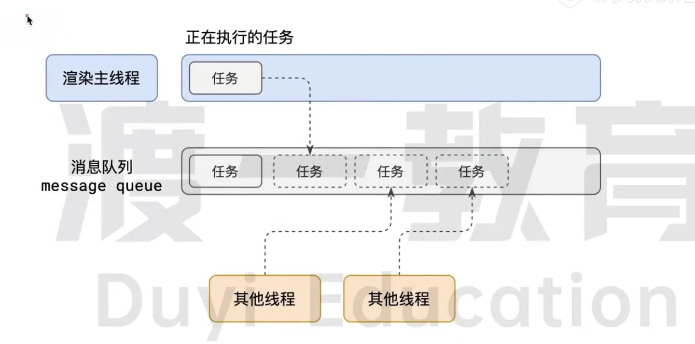

<!--
 * @Author: taoll 13361649932@163.com
 * @Date: 2023-04-24 15:50:17
 * @LastEditors: taoll 13361649932@163.com
 * @LastEditTime: 2023-04-24 17:58:48
 * @FilePath: /my-blog/src/event-loop.md
 * @Description: 这是默认设置,请设置`customMade`, 打开koroFileHeader查看配置 进行设置: https://github.com/OBKoro1/koro1FileHeader/wiki/%E9%85%8D%E7%BD%AE
-->
# 浏览器的进程模型
## 什么是进程
程序运行需要有他自己的专属的内存空间，可以把这块内存空间理解为进程
## 什么是线程
有了进程后，就可以运行程序的代码了
运行代码的‘人’，称之为线程
一个进程至少有一个线程，所以进程开始时会自动创建一个线程，这个线程称之为主线程
## 浏览器有哪些进程和线程？
浏览器是一个多进程多线程的应用程序
浏览器内部工作极其复杂，为了避免相互影响，减少连环崩溃的几率，浏览器启动后，会自动启动多个进程。
![event-loop01](./images/event-loo

其中，最主要的进程有：
1. 浏览器进程
   主要负责 界面显示，用户交互，子进程管理等。
2. 网络进程
   负责加载网络资源。
3. 渲染进程
   渲染进程启动后，会开启一个渲染主线程，主线程负责执行HTML CSS JS代码
## 渲染主线程是如何工作的？
处理的任务包括但不限于：
1. 解析 HTML
2. 解析 CSS
3. 计算样式
4. 布局
5. 处理图层
6. 每秒吧页面画60次
7. 执行全局 JS代码
8. 执行时间处理函数
9. 执行计时器的回调函数
10. ...
    
要处理这么多的任务，这样就遇到一个问题，怎么去调度任务? 排队

1. 在最开始的时候，渲染主线程会进入一个无限循环
2. 每一次循环会检查消息队列中是否有任务存在，如果有，就取出第一个任务执行，执行完第一个后进入下一次循环。如果没有就进入休眠状态
3. 其他所有线程可以随时向消息队列添加任务。新任务会添加到消息队列的末尾
  这样一来就可以让每个任务有条不紊的持续的进行下去了。
  这个过程，就是事件循环。事件循环发生在渲染主线程上

## 什么是异步？
代码在执行过程中，会遇到一些无吗立即执行的任务，比如
* setTimeout setInterval
* 网络通信 XHR Fetch
* 用户操作后需要执行的任务 addEventListener
如果让渲染主线程等待这些任务的时机到达，就会拿导致主线程长期处于阻塞状态，从而导致浏览器卡死，因此浏览器选择异步的方式来解决问题

问题： 如何理解js的异步？
Js是一门单线程的语言，这是因为它运行在浏览器的渲染主线程中，而主线程只有一个。
而渲染主线程承担着诸多的工作，渲染页面，执行js等
如果使用同步的方式，就有可能导致主线程产生阻塞。从而导致消息队列中的其他任务无法得到执行。这样一来会导致繁忙的主线程白白的消耗时间，另一方面导致页面无法及时得到更新，给用户造成卡死的现象
所以浏览器采用异步的方式来避免。当某些任务发生时，比如计时器，网络，事件监听，主线程将任务交给其他线程去处理，自身立即结束任务的执行，转而执行后续代码，当其他线程完成时，将事先传递的回调函数包装成任务，加入消息队列的末尾排队，等待主线程调度执行。在这种异步模式下，主线程永不阻塞，从而最大限度保障了单线程的流畅运行

## JS为何会阻塞渲染？。。。
## 任务有优先级吗？
任务没有优先级，在消息队列中先进先出
但消息队列是有优先级的
* 每个任务都有一个任务类型，同一类型的任务必须在一个队列，不通类型的任务可以分属于不同的队列，在一次事件循环中，浏览器可以根据实际情况从不同的队列中取出任务执行
* 浏览器必须准备一个微队列，微队列中的任务优先所有其他任务执行

目前chrome的实现中至少包含了以下的队列
* 延时队列： 用于存放计时器到达后的回调任务，优先级【中】
* 交互队列： 用于存放用户操作后产生的事件处理函数，优先级【高】
* 微队列： 用户存放需要最快执行的任务 ，优先级【最高】

添加任务到微队列的主要方式是 Promise MutationObserver
例如：
`
Promise.resolve().then(()=>{})
`

## 阐述一下js的事件循环？
事件循环是浏览器渲染主线程的工作方式
在chrome源码中，它开启一个不会结束的for循环，每次循环从消息队列中取出第一个任务执行，而其他线程只需要在合适的时候将任务加入到队列末尾即可。
每个任务有不同的类型。同类型的任务必须在同一个队列，不同任务可以属于不同队列。不同任务队列有不同的优先级，在一次事件循环中，由浏览器自行决定取哪一个队列的任务。但是浏览器必须有一个微队列，微队列的任务一定具有最高的优先级，必须优先调度执行。